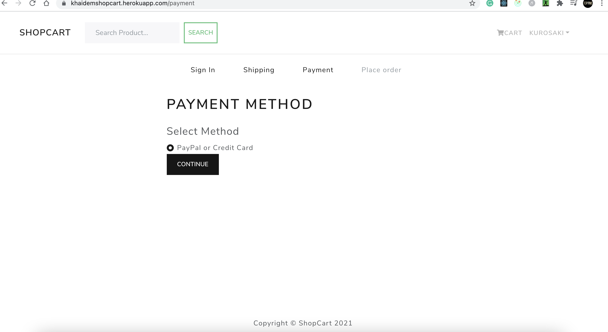

# MERN APPLICATION (SHOPPING WEBSITE)

It is an eCommerce application made in the MERN stack. Here you can register, login, order products, search products. If you have admin privileges, you can add new products.

## Table of contents

- [Overview](#overview)
  - [Screenshot](#screenshot)
  - [Links](#links)
- [My process](#my-process)
  - [Built with](#built-with)
  - [What I learned](#what-i-learned)


## Overview

This project has been done for the practice of developing skills in the MERN stack. This is my first time connecting NodeJs and React. I have done NodeJS and React separately, and this is the first project in the MERN stack.

### Screenshot





### Links

- Live Site URL: [Live Website](https://khaidemshopcart.herokuapp.com/)

## My process

First, I made the Front end in React JS, where I fetch a list of products from a JSON file. Then I made Backend in NodeJs. First, I made the database Scheme in Mongodb for the products lists, users list. Then I import the JSON product list to MongoDB. I made routes for each page by connecting to MongoDB, where the CRUD functionality is implemented. Redux replaces the overall structure of the ReactJS. The process is overall repeated again and again to make all the new pages. Paypal Sandbox integration is also implemented.

### Built with

- HTML
- CSS
- React Bootstrap
- JavaScript
- ReactJS
- Redux
- MongoDB
- NodeJS

### What I learned

I got to learn how to connect ReactJS with NodeJs. I also got a fair idea of how Redux works because of repeated implementation functionalities. I also learned how easy it is to work with MongoDB in less code.

```js
export const ORDER_CREATE_REQUEST = "ORDER_CREATE_REQUEST";
export const ORDER_CREATE_SUCCESS = "ORDER_CREATE_SUCCESS";
export const ORDER_CREATE_FAIL = "ORDER_CREATE_FAIL";

export const orderCreateReducer = (state = {}, action) => {
  switch (action.type) {
    case ORDER_CREATE_REQUEST:
      return {
        loading: true,
      };
    case ORDER_CREATE_SUCCESS:
      return {
        loading: false,
        success: true,
        order: action.payload,
      };
    case ORDER_CREATE_FAIL:
      return {
        loading: false,
        error: action.payload,
      };
    default:
      return state;
  }
};

const reducer = combineReducers({
  orderCreate: orderCreateReducer,
});
const initialState = {};
const middleware = [thunk];
const store = createStore(
  reducer,
  initialState,
  composeWithDevTools(applyMiddleware(...middleware))
);

export const createOrder = (order) => async (dispatch, getState) => {
  try {
    dispatch({
      type: ORDER_CREATE_REQUEST,
    });
    const userInfo =
      localStorage.getItem("userInfo") != null
        ? JSON.parse(localStorage.getItem("userInfo"))
        : "";
    const config = {
      headers: {
        "Content-Type": "application/json",
        Authorization: `Bearer ${userInfo.token}`,
      },
    };
    const { data } = await axios.post(`/api/orders`, order, config);

    dispatch({
      type: ORDER_CREATE_SUCCESS,
      payload: data,
    });
  } catch (error) {
    dispatch({
      type: ORDER_CREATE_FAIL,
      payload:
        error.response && error.response.data.message
          ? error.response.data.message
          : error.message,
    });
  }
};
```
